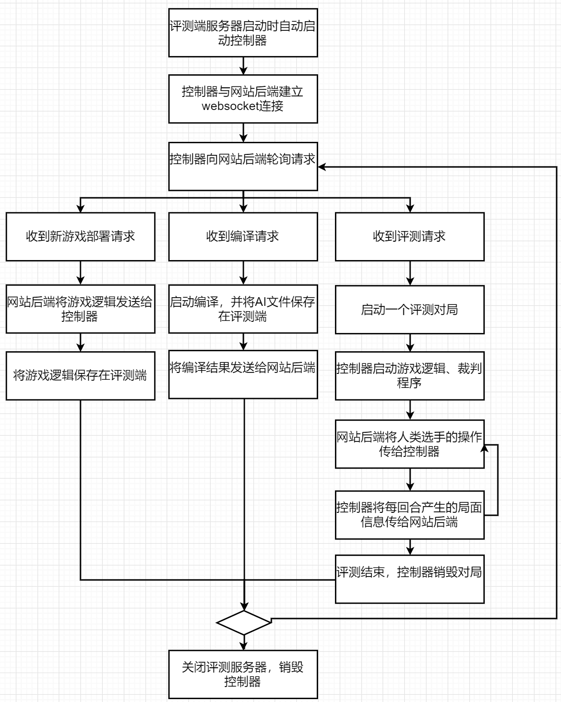

# 控制器

控制器的生命周期如下：

***注：暂定游戏部署方案如此，可能还会有更改，尚未确定游戏部署请求的通信格式。***

控制器主要控制着评测启动、销毁以及与网站后端的交互，**同时进行评测端的Websocket端口管理**。

新游戏部署时网站后端应发送如下消息：

* 游戏的唯一标识符
* 完整的游戏逻辑

*部署完成后网站后端将会收到部署完毕的信号*

AI编译时网站后端应发送如下消息：

* AI的唯一标识符
* 编译器及其版本
* 完整的AI源代码

编译完成后，控制器应发送如下消息:

* 编译是否成功
* 若编译失败，则发送编译器的错误信息

启动评测（对局）时，网站后端应发送如下消息：

* 评测的游戏的标识符
* 评测中参与的选手数，及每个选手AI的唯一标识符
  * 若选手为人类，则使用其他的标识方式

评测结束时，控制器应发送如下消息：

* 最终的局面，选手得分情况/胜负情况