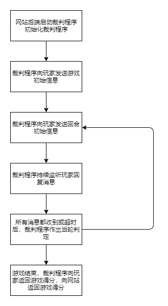

# 裁判程序

裁判程序的生命周期如下



**裁判程序不会建立任何socket通信，与后端的通信都会通过控制器进行。**

每一回合，裁判程序接收到的消息如下

- 游戏逻辑发送给裁判程序多份局面信息，每份局面信息对应一个玩家（AI客户端），即不同玩家收到的局面信息可能是不一样的
- 来自玩家的操作信息
- 来自控制器的控制消息（例如强制结束消息，裁判程序一旦收到强制结束消息，立即结束比赛并返回比赛结果）

裁判程序发出的消息如下

- 发送给玩家的消息
- 发送给游戏逻辑的消息
- 发送给控制器的消息（如需要通过socket发送给播放器的局面/操作信息）


## 与游戏逻辑/AI的通信样例

```json
// game to judger: normal round
{
	"state": "233",
	"player": ["player1", "player2"],
	"content":
	[
		{
			"top": "blue_0",
			"color": "blue",
			"card": ["blue_1", "red_0"],
		},
		{
			"top": "blue_0",
			"color": "blue",
			"card": ["none+4", "none_W"],
		}
	],
	"listen": ["player2"],
}

// game to judger: end round
{
	"state": "0",
	"end_info":
	{
		"player": ["player1", "player2"],
		"score": ["0", "100"]
	}
}

// judger to player 2
{
	"state": "233",
	"top": "blue_0",
	"color": "blue",
	"card": ["none+4", "none_W"],
}

// player to judger
{
	"state": "233",
	"card": "none+4",
	"color": "yellow",
}

// judger to game
{
	"player": ["player2"],
	"content": [
		{
			"state": "233",
			"card": "none+4",
			"color": "yellow",
		}
	]
}
```

